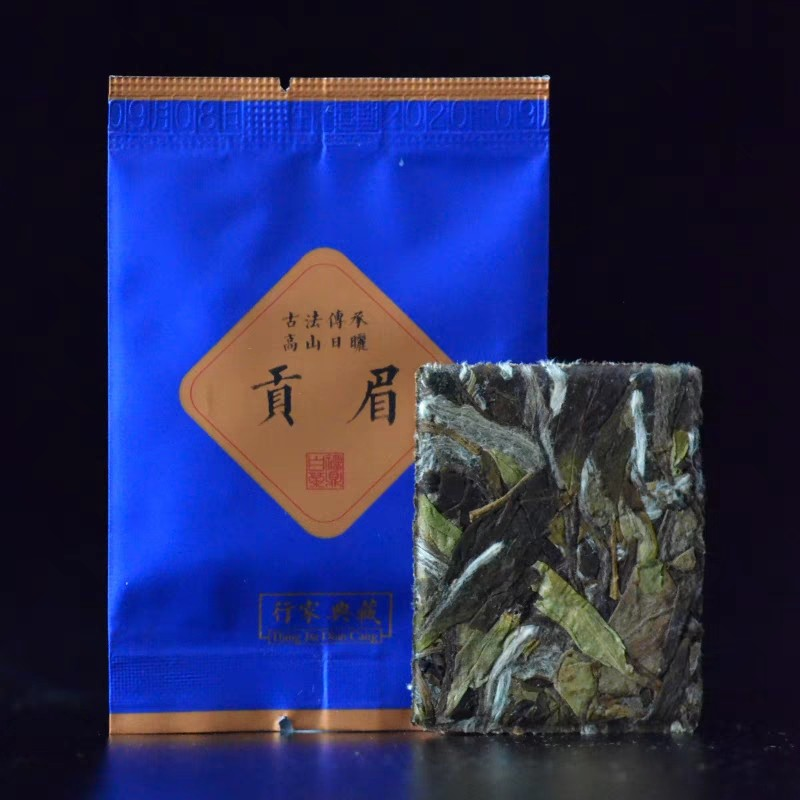
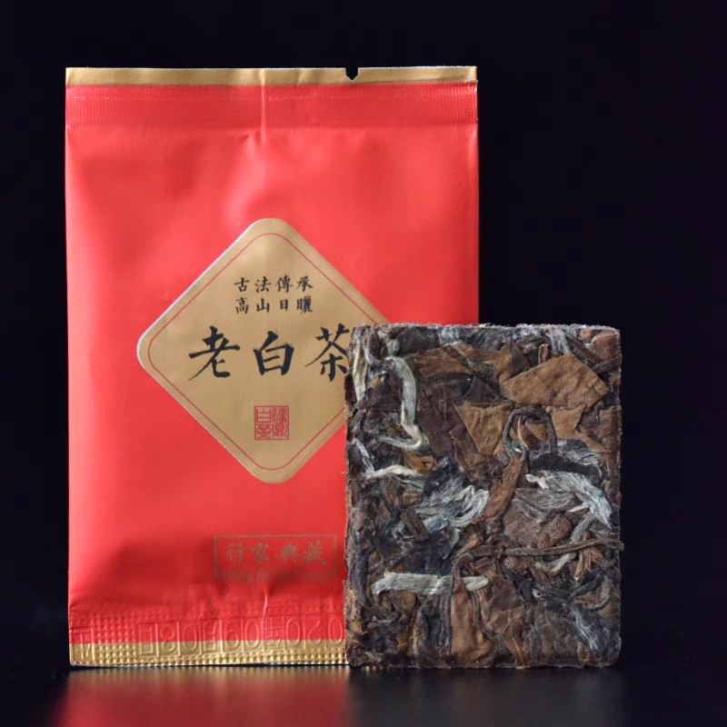
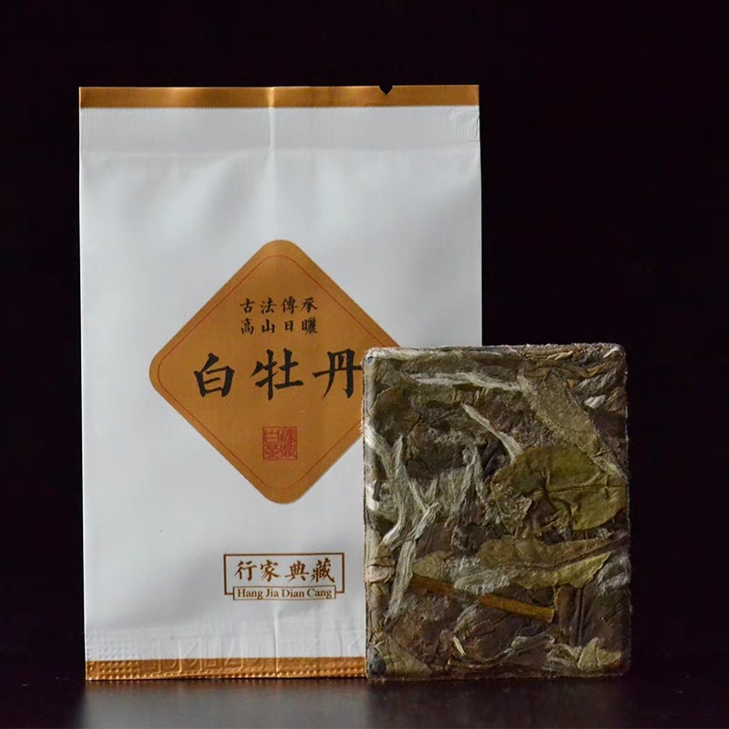
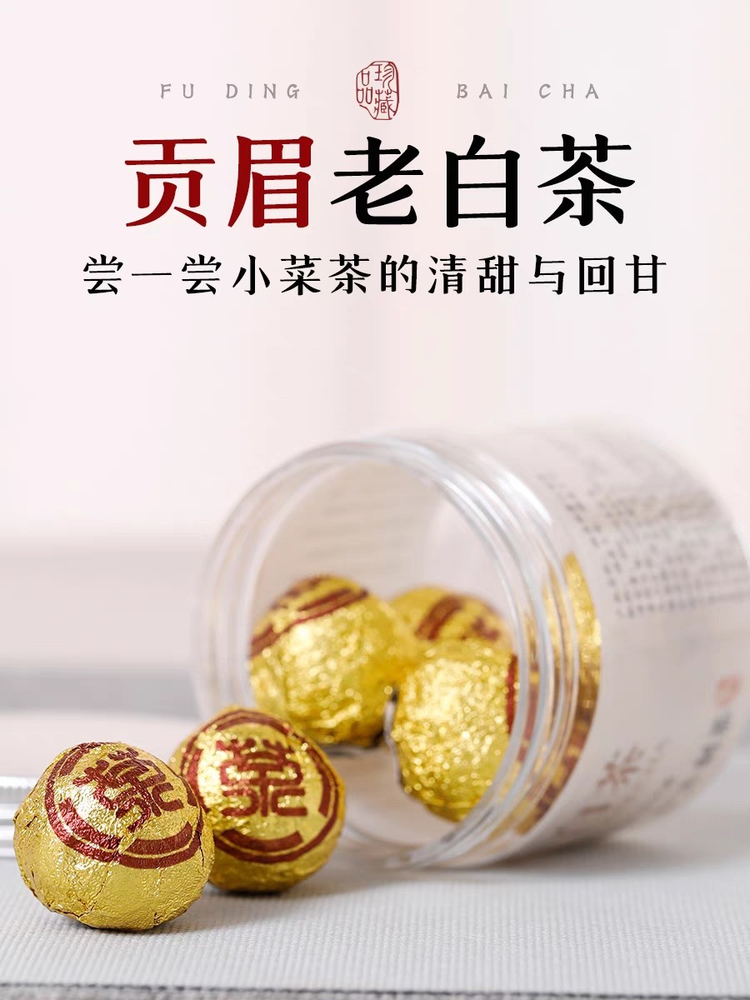
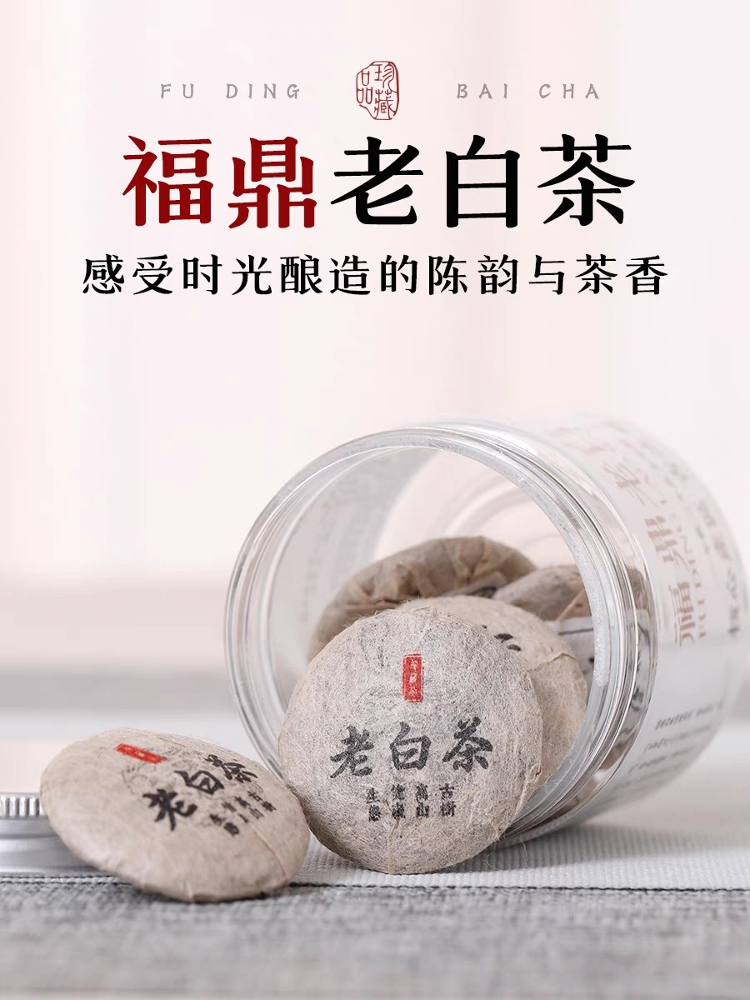
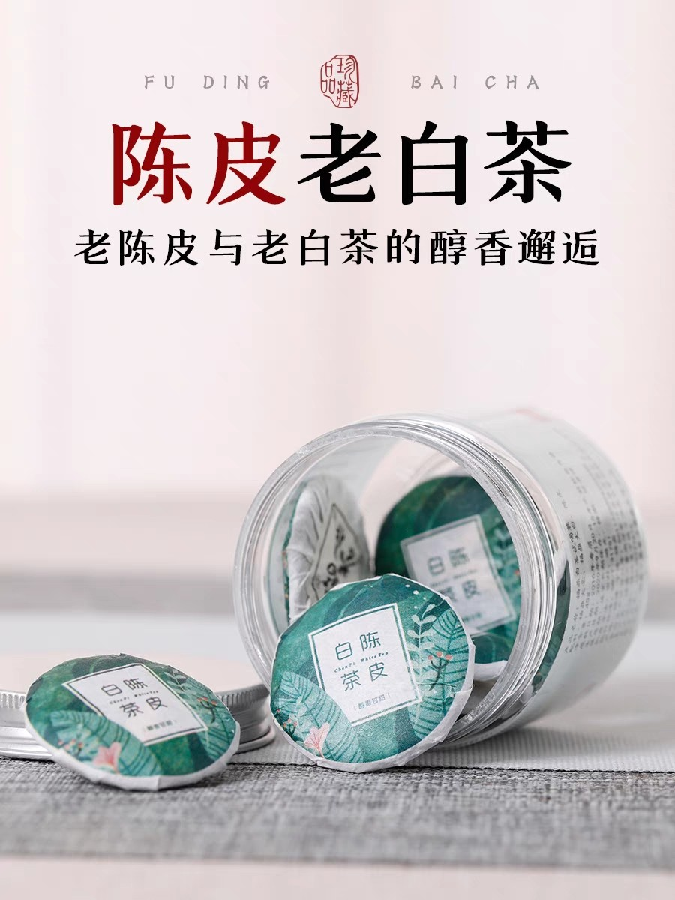

# 白茶

采摘后不经过杀青或揉捻，只经过日晒或文火干燥后所制成的微发酵茶。

特色是香气淡雅，茶汤颜色淡，口感鲜醇甘甜，入喉清爽。

## 功效

白茶具有保健功效，白茶比绿茶更为具有**抗病毒**和**抗细菌**功效；

白茶具有更多的儿茶素，具有**抗菌**、**除臭**、**防蛀**等多种功效；

白茶中茶多酚的含量较高，是天然的抗氧化剂，可以起到**提高免疫力**和**保护心血管**等作用。

## 产地

好质量白茶的产地是福鼎市，尤其是管阳，点头，磻溪，白琳等四镇

云南近年来的白茶质量也不错，百年以上的古树氨基酸含量比较高，芳香物质也因为气候的原因比较突出，其白茶果香和花香味特别浓郁。

福安、政和等地也产白茶，但质量没有福鼎的好。

## 品种

若采单芽制成的茶称为白芽茶，如**白毫银针**；

若采一芽叶、一芽二叶制成的茶称为白叶茶，如**寿眉**、**贡眉**、**白牡丹**。

**寿眉**

+ 寿眉的发酵程度是最高的，所以它的味道特别醇厚，也相对来说比较浓郁；
+ 好的寿眉能品出明显的枣香，并带有微微的药香；
+ 价位较低，可以当做白茶的入门茶。

**贡眉**

+ 寿眉的发酵程度是次之，口感也特别鲜醇，茶汤的颜色相对来说也比较黄，呈明显的橙黄色或者土深黄色；
+ 好的贡眉喝完后会到嗓子非常舒服，舌尖萦萦绕绕的都是那种鲜美。

**白牡丹**

+ 好的白牡丹冲泡之后不光香气特别芬芳，在杯中也像刚刚开的小花朵一样；
+ 价格比较昂贵。

**白毫银针**

+ 质量最高也最稀少，没有页面只有芽头，所以一根一根的像针一样，表面的白毫染上一层银色；
+ 价格最昂贵，且难入手。

## 冲泡

**新茶沸水冲泡，三年老茶煮沸饮用**

+ 新茶没有经过时间的历练，所以它所含的茶多酚、儿茶素以及咖啡因的含量比较高。如果煮着喝的话，会导致这些物质大量溶解到茶汤中，这就导致茶汤药味重，苦涩，喝了喉咙不舒服。
+ 且新茶冲泡时一定要用沸水，也只有沸水才能激发出白茶特有的香气。
+ 老茶其内部成分发生变化，必须经过煮沸其中的各种芳香物质才会随着水温的升高逐渐融入茶汤中，这样香气才浓郁，口感才醇厚。如果单靠沸水冲泡的话，温度下降过快，口感自然寡淡，甚至出现怪味。

**新茶快过水，老茶慢过水**

+ 新茶由于各种物质溶解的快，如果闷泡个三五分钟，这就导致融入茶汤中的物质达到极点。茶里的氨基酸、维生素、茶多酚全都被破坏掉了，而咖啡因的含量反倒增高了。
+ 新茶用沸水冲泡三秒钟之内就要出水。此时茶叶受到最初的刺激，香味开始渗出，营养还没有受到破坏，不苦不涩，口感是最好的。而后面几泡则可以适当延长过水的时间，第 2 泡 5 秒，第 3 泡 15 秒，第 4 泡可以焖泡坐杯 1 分钟。
+ 老茶的溶解方式是循序渐进的，其中以老寿眉最为突出。老寿眉的药味儿最重，也最为温和，一定要煮着喝。
+ 煮老茶时先煮水，水开投入茶叶立即关火，等待 25~30 秒时就可以出汤了。当壶中茶水只有 1/4  时可以继续倒入开水煮茶，水开后再关火，等待 30～60 秒即可继续出汤饮用。此后每一泡都如此反复，也可以适当延长等待的时间。
+ 白茶也可以做成冷萃茶。其做法是准备一瓶矿泉水放入3-5g 白茶后拧紧瓶盖，放入冰箱里冷藏 12 小时。不过肠胃不好的人不推荐。

**无论新茶还是老茶，宜淡不宜浓**

+ 白茶未过火所以比较寒凉。一般来说 120ml 的水投入 3~5g 新茶就够了。
+ 如果是煮茶 300ml 左右的煮茶壶投入老茶 3g。

## 试喝

<left>
  
</left>

+ 价格：3.3¥ - 5g
+ 品质：多是碎叶片和茶梗
+ 味道：难喝，十分难喝，一股怪味！

<left>
  
</left>

+ 价格：1.7¥ - 5g
+ 品质：叶片比较完成，能看出是一芽两叶
+ 味道：贡眉老白茶闻着有很轻微的枣香，喝着比较润喉，喝完嗓子有点微微的回甘和干涩；福鼎老白茶喝完后干涉感更明显；陈皮老白茶。

# 参考

[维基百科-白茶](https://zh.wikipedia.org/wiki/%E7%99%BD%E8%8C%B6) 

[白茶怎么泡好喝，我喝的是福鼎白茶，怎么觉得那么难喝啊？](http://www.xieeo.com/shenghuo/2932.html) 